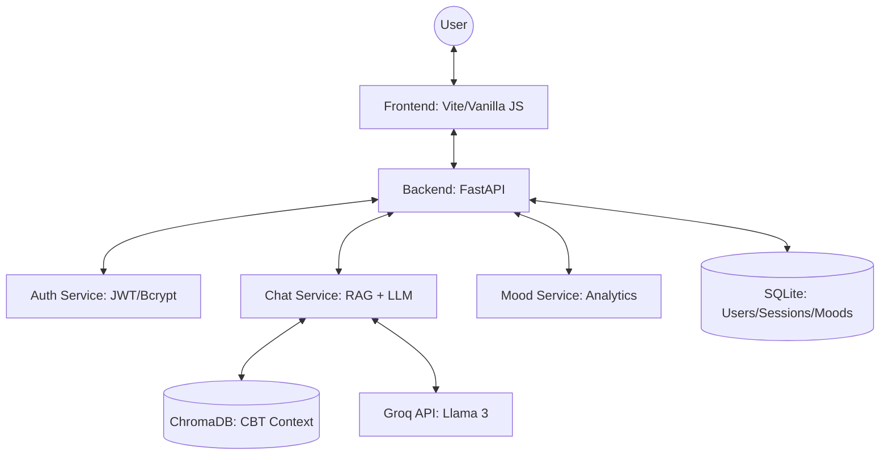

# MindBridge — AI Psychological Counsellor: Handover Report

## 1. Project Overview
**MindBridge** is a compassionate AI counselling companion designed to provide immediate emotional support and grounding techniques. It leverages **Cognitive Behavioral Therapy (CBT)** principles and state-of-the-art LLMs to offer a safe, private space for users to express their feelings and track their mental well-being.

> [!NOTE]
> This project was built with a focus on high-impact, low-latency interactions and a calming, therapeutic user experience.

---

## 2. Technical Architecture

### Tech Stack Breakdown
| Layer | Technology | Key Libraries |
| :--- | :--- | :--- |
| **Frontend** | Vite + Vanilla JS | `Web Speech API`, `Canvas` (for breathing animations) |
| **Backend** | FastAPI (Python 3.11+) | `SQLAlchemy` (async), `Pydantic`, `Groq-Python` |
| **Database** | SQLite + ChromaDB | `aiosqlite`, `chromadb`, `sentence-transformers` |
| **AI Support** | Groq Cloud | `llama-3.3-70b-versatile` (or `llama-3.1-8b-instant`) |
| **Deployment**| Vercel & Render | Docker, Docker Compose |

### System Diagram


---

## 3. Core Features & Implementation Details

### 🧠 RAG (Retrieval-Augmented Generation) Pipeline
- **Knowledge Base**: Comprised of 10 comprehensive CBT technique documents stored in `backend/cbt_documents/`.
- **Ingestion**: `python -m app.rag.ingest` processes these documents into chunks, generates embeddings using `all-MiniLM-L6-v2`, and stores them in ChromaDB.
- **Retrieval**: For every user message, the system searches ChromaDB for the most relevant techniques and injects them into the LLM system prompt as context.

### 🚨 Crisis Detection Engine
The system uses a tiered, rule-based detection system (`backend/app/chat/crisis.py`) to ensure safety:
- **Tier 1 (Critical)**: Suicidal ideation or immediate self-harm. Responds with immediate emergency helpline numbers and disables AI-only dialogue.
- **Tier 2 (High Distress)**: Severe anxiety or panic. Triggers a grounding exercise and provides support resources.
- **Tier 3 (Moderate)**: Persistent sadness or hopelessness. Offers compassionate listening and suggests professional help if symptoms persist.

### 📊 Mood Tracking & Analytics
- Users can log their mood (1-5 scale) with optional notes.
- **Mood Analytics**: The system uses the LLM to generate "Insights" based on mood trends over time, helping users identify triggers or patterns.
- **Sparklines**: Visualization of mood trends directly in the sidebar.

### 🧘 Breathing Exercise
- An interactive, canvas-based "Box Breathing" tool with rhythmic animations and voice guidance (if enabled).

---

## 4. Deployment & Configuration

### Environment Variables (.env)
The following keys are required in the `backend/.env` file:
```bash
GROQ_API_KEY=your_groq_api_key_here
JWT_SECRET=your_long_random_string_here
CORS_ORIGINS=https://your-frontend.vercel.app,http://localhost:5173
```

### Hosting
- **Frontend**: Deployed on **Vercel**. Configuration is handled via `frontend/vercel.json` to manage API proxying and SPA routing.
- **Backend**: Deployed on **Render**. Configuration uses `backend/Dockerfile` and `runtime.txt`.
- **Database**: SQLite is used for simplicity; in production on Render, ensure you use a **Persistent Disk** for the `mindbridge.db` and `chroma_db/` directory, or migrate to PostgreSQL.

---

## 5. Current Status & Next Steps

### Feature Status
- [x] JWT Authentication & User Registration
- [x] Multi-session Chat History
- [x] Voice-to-Text Input (Speech-to-Text)
- [x] Dark/Light Mode Persistence
- [x] RAG Pipeline with CBT Documents
- [x] Crisis Response System

### Roadmap / Potential Improvements
1. **Persistent Vector Store**: Currently uses a local ChromaDB instance. Migrating to a managed vector DB (like Pinecone or Weaviate) would improve scalability.
2. **PostgreSQL Migration**: For handling larger datasets and better concurrent access than SQLite.
3. **Advanced Crisis NLP**: Moving from rule-based detection to a small, specialized NLP classifier for more nuanced distress detection.
4. **Mobile App**: Wrapping the existing responsive web app with Capacitor or React Native for app store distribution.

---

> [!TIP]
> To get started locally, follow the `README.md` steps: Install requirements, run the ingestion script, and start the FastAPI server alongside the Vite dev server.
